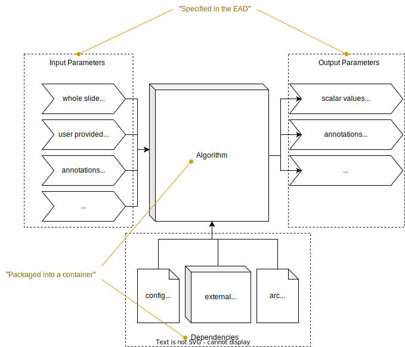

# Empaia API "How-to?"

This repository exemplifies how to develop custom algorithms (plugins) for the [Empaia Platform](https://empaia.org).
For a much more in-depth documentation, I will refer to their [official documentation](https://developer.empaia.org/#/).
The general workflow when you plan to develop your own algorithm for their market place is as follows:

1. Prepare your algorithm 
1. Write an _Emapaia App Description (EAD)_
1. Set up testing environment locally (optional)
1. Understand the Empaia REST API (optional)
1. Write glue code 
1. Containerize your application

> [!NOTE]
> If you spot any typos or things that are fundamentally wrong you are invited to contribute to this guide [by making a pull request](https://github.com/patologiivest/empaia-howto/compare).
> Also, feel free to "flesh out" the `samples/` directory! 

## Step 0: Hardware requirements 

In order to follow a long with this guid you have to have a machine that can 

- Run `python` (version >= 3.8) and install python packages from PyPI,
- run `docker` both CLI and deamons.

In general, this means you must have root/administrator access to a Linux, MacOS X, or Windows (including Windows subsystem for Linux)
workstation with virtualization enabled in the BIOS.

## Step 1: Prepare your application 

We assume that you have your image analysis machine learning algorithm ready, which can be run _headlessly_.
In this guide, we only consider programming language since it is the most popular among machine learning afficinados. 
If you want to use another language, in the final step "Containerization", you have to adjust your `Dockerfile` 
accordingly. If you do not know how to do this, ask [past@hvl.no](mailto:past@hvl.no).

Hence, as a first step you should clarify for yourself how the following architecture will look concretely for your 
algorithm, i.e.:



- What user inputs aside from the _whole slide image (WSI)_ are needed?
- What outputs should your algorithm produce: a single statistic (floating point number), structured information, or 
annotations (e.g. when segmenting),
- What other dependencies your algorithm (external binaries, local config files, neural network weights from a training
phase)?

For the remainder, we assume that your algorithm lives in a file called `alg.py` and is encapsulated as a function:
```python
def run_algorithm(tiles, other_input_arg, ...):
   ...

```
where `tiles` is expected to be an iterable containing relevant image tiles (represented as image objects or numpy arrays) of the whole slide image, 
`other_input_arg` and following are other user input parameters (depending on you algorithm).
Also, all required Python packages and their version numbers should be explicated within an `Requirements.txt` file.
The latter can easily be creted by first creating a virtual Python environment, installing all necessary dependencies
in it, and then running `pip freeze > Requirements.txt` (or you may decide to use [Poetry](https://python-poetry.org/)
instead :wink:).

## Step 2: Write an "EAD"

Each Empaia "App" on the marketplace consists of two things:

- an EAD description, 
- a zipped container image of the application.

The former is a simple JSON file that contains _meta-information_ abut the algorithm, i.e. inforation that should 
be presented to the user in the user interface and, most importantly, the in- and outputs of the application. 

Below, you find an example of how such a `ead.json` file may look like:
```json
{
    "$schema": "https://gitlab.com/empaia/integration/definitions/-/raw/main/ead/ead-schema.v3.json",
    "name": "My Cool Medical AI Algorithm",
    "name_short": "Cool App",
    "namespace": "org.empaia.helse_vest_piv.cool_app.v3.1",
    "description": "Does super advanced AI stuff, you know...",
    "io": {
        "my_wsi": {
            "type": "wsi"
        },
        "my_quantification_result": {
            "type": "float",
            "description": "Human readable text, e.g. super important metric",
            "reference": "io.my_wsi"
        }
    },
    "modes": {
        "standalone": {
            "inputs": [
                "my_wsi"
            ],
            "outputs": [
                "my_quantification_result"
            ]
        }
    }
}
```
The fields
- `$schema`,
- `name`,
- `name_short`,
- `namespace`,
- `description`,
- `io`, and 
- `modes`

are mandatory! The `$schema` property is fixed and links to [JSON schema definition](https://gitlab.com/empaia/integration/definitions/-/blob/main/ead/ead-schema.v3.json).
The properties `name`, `name_short`, and `description` are used to display a user readable (short) title (must not contain any dots or fancy symbols) and 
description in the Empaia UI. The `namespace` servces as a _unique_ identifier for you app. Therefore, it has to 
follow a specific naming scheme, see [here](https://developer.empaia.org/app_developer_docs/v3/#/specs/ead?id=namespace)!
The `io` section defines all the parameters that will be used as in- or output for the app, see respective section below.
Finally, the `modes` section defines the _execution mode_ in which the app will run and what in- and output parameters 
will be used then. For our purposes, we will stick with the `standalone` mode most of the time.

Have a detailed look [here](https://developer.empaia.org/app_developer_docs/v3/#/specs/ead) if you want to see the complete spec!

## In- and Output parameters

Parameters are specified inside the `io` section of the `ead` and follow a fixed structure:
```json
{
    "<name>" : {
        "type": "<see below>",
        "description": "<optional, human-readable presentation>",
        "reference": "<optional, reference to another parameter>"
    }
}
```
The Empaia supported parameter types can be classified into the following categories

- the whole slide image itself (`"type": "wsi"`), there will be always **exactly one** such parameter, you can only customize its name and description,  
- primitive values, i.e. `"type": "integer|float|bool|string"`, can be used for scalar values, which can be integer/floating point numbers, truth values, or character sequences (text),
- graphical annotations where `"type"` takes one of `point`, `line`, `arrow`, `rectangle`, `polygon`, `circle`,
- collections (`"type": "collection"`) wrap another parameter type to allow for multiple occurances of the wrapped type, e.g. sequence of rectangles,
- finally there is also a `class` parameter type, which represents catgorical values. In general, this type is used in combination
with annotations and also requires to define the classes at the root of the `ead` (see [details](https://developer.empaia.org/app_developer_docs/v3/#/specs/ead?id=class-data-type)).

> [!IMPORTANT]
> The generic Emapaia UI requires you to also have at least one _annotation_-type input. 
> Hence, in order to hook you app into the provided generic Emapaia UI, you have to add such an input parameter, e.g.
> of type `rectangle`, even if you are not using it any further.

The `reference` property plays an important role for assembling a structured result:
In order for the generic Emapai App UI to display the results of your algorithm, they all have to link back to the `wsi`
parameter! The general idea is that references should induce a tree structure with the `wsi` parameter on top, see [also](https://developer.empaia.org/app_developer_docs/v3/#/specs/references?id=structured-presentation):
```
my_wsi
├── my_quantification_result
└── my_segmentation_results
    ├── recatangle_0
        └── class_good
    ├── recatangle_1
        └── class_bad
    ...
    └── recatangle_1
        └── class_good
```

## Step 3: Set up testing environment: Empaia App Test Suite (EATS)

Empaia provides a test suite such that you can test your application before handing it over to Empaia to make sure 
it does what it is expected to do. 

The eats test suite spuns up a whole infrastructure of services on your machine: Think of it as a simplified version of the
Empaia platform. To this end, the container engine [Docker](https://www.docker.com/) is used (and this means specifically Docker! 
Alternative container engines such as Podman, containerd, LXC do not work...).
Hence, you have docker installed on your system first.

> [!NOTE]
> The container virtualization technology underlying Docker and co. is provided by powers of the Linux kernel.
> Hence, containers basically _only_ work under Linux. However, with some "tricks" containers can be also run on 
> Windows and Mac OS X (using a hypervisor). This is also the reason why Docker is _free to use_ only on Linux 
> and for private or open source projects only when you are on Windows or Mac. 
> If you plan to use Docker for Windows/Mac in an organizational context, you have to obtain a licence!
> Also the performance of containers on Windows/Mac will always be sub-par compared with their Linux equivalent
> and should therefore only be used for testing purposes.

Follow the official guide on how to install Docker for your operating system:
- [Mac Install Guide](https://docs.docker.com/desktop/install/mac-install/)
- [Windows Install Guide](https://docs.docker.com/desktop/install/windows-install/)
- [Linux Install Guide](https://docs.docker.com/desktop/install/linux-install/)

When Docker is installed you can install `eats` simply as a [python package](https://pypi.org/project/empaia-app-test-suite/), 
i.e. open a up a command line (if you use windows, you have to enter a Linux shell in WSL via the Windows Terminal) and type:
```bash
pip install empaia-app-test-suite
```
or if the `pip` binary should not be available on your `$PATH` by accident:
```
python3 -m pip install empaia-app-test-suite
```

Next, you should collect some slide images that you want to use in the test suite and place them into a working directory.
Navigate to a nice location in you file system using the command line (recall that you use `cd` to change directories and 
`pwd` to see where you currently are), create a folder called `eats`, including a sub-folder
for the `images`:

```bash
mkdir eats
cd eats
mkdir images
```

Open a file explorer at the respective location and then move the slide images into the `images` folder.

Before, we can start EATS, we have to create one more json file called `wsi-mount-points.json` and place it directly
beneath the `eats` directory. The content of this file will look something like
```json
{
    "/global/path/to/eats/images": "/data"
}
```
, where the `/global/path/to/` is a placeholder for the fully-qualified path from the root of your file system to the newly
created `eats` directory. 

> [!NOTE]
> As a windows user you will necissarily run EATS from within _Windows Subsystem for Linux (WSL)_ in order to run Docker.
> Thus, paths in the Windows file system have to be aligned, concretely:
> `C:\Users\<username>\Downloads\eats\`
> becomes
> `/mnt/c/Users/<username>/Downloads/eats/`
> in WSL.

Finally, you are able to start EATS with the command:
```bash
eats services up ./wsi-mount-points.json
```

On the first startup, this may take a while since it will download the required container images onto your machine 
and start them.
When everything started, you can access the Empaia workbench under the following URL 

> <http://localhost:8888/wbc3/>

However, you won't see any cases nor slides right now.
You have to register them manually. 

Create another json file with following content: 
```json
{
    "type": "wsi",
    "path": "/data/<image-name>",
    "id": "<id>"
}
```
The `<image-name>` must coincide with the file name of an image in the `/eats/images` folder. 
The `<id>` is expected to be an arbitrary [UUID](https://en.wikipedia.org/wiki/Universally_unique_identifier) (you can 
create random uuid's in the command line using the binary `uuidgen` :wink:).

Name the file something like `slide1.json` and register the slide with:
```bash
eats slides register slide1.json
```
If you have multiple slides in your `/images` folder, you have to repeat this process for all files in that folder 
in order to be able to see them in the workbench client. 
Remember to change the value in `<image-name>` accordingly and provide a fresh UUID for each of them!

When opening the workbench client again, you will spot the cases/images that you just registered with their respective 
ids. Selecting a case will lead you to another screen where you can select a slide, which again opens the generic image 
viewer where you can navigate around as well as zoom in and out. 
On the left side panel you should also see a message telling you that there are no apps yet!
We will fix this in the next steps.

## Step 4: Understanding the EMPAIA REST API

The Empaia platform treats the registered apps/algorithms as _black boxes_, more conrectly: as [container images](https://docs.docker.com/get-started/overview/#images).
The container image is a bluprint of an arbitrary application that packages all its dependencies. 
When the application starts it needs access to its input parameters (most importantly the whole slide image data).
The application retrieves this information by asking the EMPAIA platform through HTTP, i.e. the platform offers 
a REST API that apps use to download parameter data and upload results. 

With EATS running, you can access the up-to-date API documentation behind the following URL:

> <http://localhost:8888/app-api/v3/docs>

It is recommended to familiarize yourself a bit with this API in order to write the glue code for your app.
However, in order to be able to access the API with a client you will need a `JOB_ID` and an `EMPAIA_TOKEN`.
To get these, we first need to register an `APP`.

Apps are registered by providing (i) an `ead.json` file and (ii) the name of a container image registered in the local Docker 
container registry.

> But how?

You may ask now! We are just about to understand how the Empaia API works in order to be able to develop our app.
So we are running into an Egg-and-Hen problem, right? Well, theoretically yes! But noboday said we have to nail it 100% 
on our first try. So lets just build a stub container image right now in order to be able to register an app 
and then we can later update our container image when we have the final application ready.

So lets start by "containerizing" a super-simple python app:
Create a directory `app/` containing a file `glue.py` and a file called `Dockerfile`.

`glue.py` Content:
```python
print("Hello World")  # Creative isn't it?!
```

`Dockerfile` content:
```Dockerfile
FROM python:3.11-slim
COPY . /app
WORKDIR /app
CMD ["python3", "glue.py"]
```

This is the bare minimum to get a Python app in a container that prints `"Hello World"`.
You will build the image with the command. The name `my_app` is variable and can be freely chosen.
It is important to remember it for the stage when we register the app.
```bash
docker build -t my_app .
```

The app is registered with
```bash
eats apps register ead.sjon my_app
```

The result of the aforementioned command will contain the `APP_ID`. 
We have to note it down because we will need it for the next step!
As we are currently living on the command line this means will be save the output of the previous command 
as an _environment variable_: Simply copy the `APP_ID=...` part and prepend it with an `export ` -> Press Enter. 

Entering 
```bash
echo $APP_ID
```
should yield the saved value.


With an `APP_ID`, we can create a _job_, i.e. an instance of the algorithm. 
But, in order to be able to be executable the job will need the input parameters. 
Later when the app is in production, the input parameters will be determined by the user's inputs. 
Now, during testing we have to explicitly provide the parameters beforehand.
This is done by writing a JSON document for each input parameter, which is mentioned in the EAD.
The JSON files have to be placed inside the same directory and their file names must coincide with the parameter names.

If you have used the simple `ead.json` example from the beginning, there will be exactly one parameter to be provided: `my_wsi`!
WSI parameters are specified in the same way as we did for registering a slide with the `eats slides register` command.
Copy the `slide1.json` file from before, copy it into a a new folder called `inputs/` and rename it to `my_wsi.json`.

```bash
eats jobs register $APP_ID /inputs
```

the result will provide you with the `EMPAIA_JOB_ID`, an `EMPAIA_TOKEN`, and the `EMPAIA_APP_API`.
The latter can be ignored for now, but the _job id_ and the _token_ are important. 
Hence: Safe them as environment variables as well!
We will need them in order to make HTTP requests. 

There is one technical thing left to be done before, we can test out the requests.
The job state has to be changed to `RUNNING`, this is done via the `eats` command line.
```
eats jobs set-running $JOB_ID
```

Puh, Finally! We are ready to interat with the EMPAIA API.
Get you favourite HTTP client started, e.g. [Postman](https://www.postman.com/) if you like it graphically or 
[curl](https://curl.se/) if you are more of an command line ninja :ninja:

All input parameters are retrieved via a GET to the folling URL:

> <http://localhost:8888/app-api/v3/$JOB_ID/inputs/{input_param_name}>

There are two variables in this path: The first is the `JOB_ID`, that we got from registering the job, and the 
`input_param_name` refers to one of the parameters defined in the EAD. 
Sticking with the running example, this is `my_wsi`.
Go ahead! Send it! (speaking of the request).

As you see when inspecting the result: You are not getting the whole slide image immediately as a response to your request.
Rather you are greeted with a JSON document containing meta-information about your slide.
It might look something like this:
```json
{
    "id": "f7dec770-b248-41eb-b584-214f819b677b",
    "channels": [
        {
            "id": 0,
            "name": "Red",
            "color": {
                "r": 255,
                "g": 0,
                "b": 0,
                "a": 0
            }
        },
        {
            "id": 1,
            "name": "Green",
            "color": {
                "r": 0,
                "g": 255,
                "b": 0,
                "a": 0
            }
        },
        {
            "id": 2,
            "name": "Blue",
            "color": {
                "r": 0,
                "g": 0,
                "b": 255,
                "a": 0
            }
        }
    ],
    "channel_depth": 8,
    "extent": {
        "x": 46000,
        "y": 32914,
        "z": 1
    },
    "num_levels": 3,
    "pixel_size_nm": {
        "x": 499.0,
        "y": 499.0,
        "z": null
    },
    "tile_extent": {
        "x": 256,
        "y": 256,
        "z": 1
    },
    "levels": [
        {
            "extent": {
                "x": 46000,
                "y": 32914,
                "z": 1
            },
            "downsample_factor": 1.0
        },
        {
            "extent": {
                "x": 11500,
                "y": 8228,
                "z": 1
            },
            "downsample_factor": 4.000121536217793
        },
        {
            "extent": {
                "x": 2875,
                "y": 2057,
                "z": 1
            },
            "downsample_factor": 16.00048614487117
        }
    ],
    "format": "file-tiff-aperio-tiffslide",
    "raw_download": true,
    "tissue": "KIDNEY",
    "stain": "H_AND_E"
}
```
What every field means is [well-documented](https://developer.empaia.org/app_developer_docs/v3/#/specs/wsi_data?id=obtaining-the-wsi-metadata) in the Empaia docs.
Let me shortly sketch the most important parts:

- The `id` will be important for the next step as wee need it to retrieve actual image data,
- `extent` shows the pixel dimensions (size) of the whole image (at zoom factor 1),
- `pixel_size_nm` shows how a pixel translates to a real-world measurement (in nanometers),
- `tile_extent` shows the dimensions of a tile,
- `levels` is an array of zoom-factors at which the image data is available at. 

Using some elementary math, we can quickly calculate that 

- for the original size (level 0) there are 23220 tiles: (0,0) to (180,129)
- zooming out with factor 4x (level 1), there are 1485 tiles: (0,0) to (45,33)
- zooming out with factor 16x (level 2), there are 108 tiles: (0,0) to (12,9)

This information comes in handy when you are using the GET endoint to download image data.

Empaia offers three ways to access whole slide image data:

1. You can use the available pre-made tiles,
1. You can download a specific region (limited to a maximum size of 5000x5000 pixels) of the image, or 
1. you can downlaod the whole slide image in a proprietary format package in a ZIP archive.

The latter is discouraged will be thus ignored in the following. 
The URLs for the first two endpoints are as follows:

1. <http://localhost:8888/app-api/v3/$JOB_ID/tiles/{wsi_id}/level/{level}/position/{tile_x}/{tile_y}>
1. <http://localhost:8888/app-api/v3/$JOB_ID/regions/{wsi_id}/level/{level}/start/{start_x}/{start_y}/size/{size_x}/{size_y}>

The parameters `wsi_id` and `level` are extracted from the WSI meta information object, obtained from our first request.
The parameters `tile_x`, `tile_y`, `start_x`, `start_y`, `size_x`, and `size_y` for the tile and region endpoints are pretty much self-explanatory.

HTTP responses from theese endpoints return the image data as a sequence of bytes.
But this is not a problem at all since it can directly be parsed by the capable [Pillow](https://pillow.readthedocs.io/en/stable/index.html)
library for python for instance, which again can be be piped directly through to Numpy etc.

As an illustration, the following Python script will retrieve a specific image tile from our example and transforms it into a `width x height x 3`
NumPy array:

```python
import os
import requests
import numpy as np
from PIL import Image
from io import BytesIO

APP_URL = "http://localhost:8888/app-api"
JOB_ID = os.environ('EMPAIA_JOB_ID')
TOKEN = os.environ('EMPAIA_TOKEN')
HEADER = {"Authorization": f"Bearer {TOKEN}"}

# Retrieve meta-data
input_url = f"{APP_URL}/v3/{JOB_ID}/inputs/my_wsi"
r = requests.get(input_url, headers=HEADER)
r.raise_for_status()
wsi_meta = r.json()
wsi_id = wsi_meta['id']

# Download tile (7,1) at level 2 
tile_url = f"{APP_URL}/v3/{JOB_ID}/tiles/{wsi_id}/level/2/position/7/1"
r = requests.get(tile_url, headers=HEADER)
r.raise_for_status()
i = Image.open(BytesIO(r.content))
a = np.array(i)
print(a.shape)
# Do something cool with your multi-dimensional array of pixel-color values, like put it in a Neural Network or so...
```

Okay, I think we are starting to get an understanding of the API now.
Lets finish off our experiments with sending some stub values back to Empaia as the output parameters of our job.
to this end, there is the POST endpoint:

> <http://localhost:8888/app-api/v3/$JOB_ID/outputs/{output_param}>

In our running EAD example the one existing output parameter was called `my_quantification_result` and was of type `float`.
Open your favourite HTTP client again and prepare the POST request with the following JSON payload:
```json
{
    "name": "The answer to the universe and everything",
    "type": "float",
    "value": 42.0,
    "creator_type": "job",  
    "creator_id": "<job-id>",
    "reference_type": "wsi",
    "reference_id": "<wsi-id>"
}
```

> [!WARNING]
> Remember to replace `<job-id>` and `<wsi-id>` with the correct information, which was obtained from registering the job 
> and requesting the WSI metadata respectively.

Finally, we can wrap up and finish our JOB by sending a PUT to the "Finalize" endpoint:

> <http://localhost:8888/app-api/v3/$JOB_ID/finalize>

## Step 5: Write the glue code 

I think now, we know enough that we are able to write the necessary integration "_glue code_"!

To make the Python build reproducible and hassle-free, exit the current virtual environment and start a new one:
```bash
deactivate
python3 -m virtualenv .venv
source .venv/bin/activate
```

Next, install **all** required libraries for your algorithm.
Below, some usual suspects as inspiration:

```bash
pip install numpy
pip install Pillow
pip install requests
...
```

When you are done, write them out to a `Requirements.txt` file:
```
pip freeze > Requirements.txt
```

Open up `glue.py` again and replace the "Hello World"-contents with some more reasonable:
You will have to write some Python code that make HTTP requests to download the parameters, call your algorithm and upload the results.
Concretely, you will have to:

1. Retrieve `EMPAIA_JOB_ID`, `EMPAIA_TOKEN`, and `EMPAIA_APP_API` as environment variables,
1. Make `GET $EMPAIA_APP_API/v3/$JOB_ID/inputs/{input_param}` requests to retrieve data for all `input_param`s,
1. Make `GET`-requests to either `$EMPAIA_APP_API/v3/$JOB_ID/tiles/...` or `$EMPAIA_APP_API/v3/$JOB_ID/regions/...` to download tiles or image regions.
1. Call your algorithm with the input parameters and image data, 
1. Upload the results via a `POST $EMPAIA_APP_API/v3/$JOB_ID/outputs/{output_param}` for all `output_param`s,
1. Signal that you are done via `PUT $EMPAIA_APP_API/v3/$JOB_ID/finalize`

You are invited to have a look into [the samples](./samples/simple/glue.py) how you make these requests.
Also, the [Empaia provided examples](https://gitlab.com/empaia/integration/sample-apps/-/tree/master/sample_apps/tutorial) and 
accompanying [explanations](https://developer.empaia.org/app_developer_docs/v3/#/tutorial_backend/simple_app) are a good reference!
The latter also demonstrate how to use `collections`, `annotations`, and `classes`.

Feel free to test your app under development in the same way as we did when exploring the API, i.e. 
manually register a _job_, set it running, and save the environment variables.

> [!WARNING]
> Remember that you have to `deactivate` the virtual environment in your `app/` folder first and `source` the
> virtual environment in the `eats` directory first, to have access to the `eats` binary again :wink:

When you are done, it is time to containerize the application again for good.

## Step 6: Containerize!

This means basically that you have to run `docker build` again with the same parameters as before. 
However, we have fleshed out the Python app quite a bit more. 
Therefore, we have to make sure that all required Python libraries are available.
Update your Dockerfle such that it looks like this:

```Dockerfile
FROM python:3.11-slim
COPY . /app
WORKDIR /app
RUN python3 -m pip install -r Requirements.txt
CMD ["python3", "glue.py"]
```

and run 
```bash
docker build -t my_app .
```

again!

Congrats! You are done :tada: ! Feel free to open the workbench and call your algorithm!


